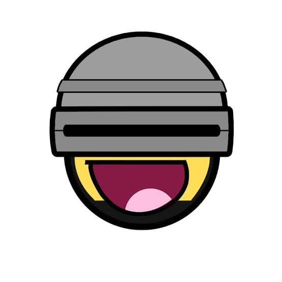

<h1 align="center">
  <br>
  
  <br>
  <p>Hydrab0t</p>
</h1>

<p align="center">
  <a href="https://github.com/apps/Hydrab0t">
    
  </a>
  <a href="https://t.me/AlQaholic007">
    
  </a>
  <a href="https://circleci.com/gh/AlQaholic007/hydrabot.svg?style=svg&circle-token=f699e937558e534c9a92a55a929aab9774cda271">
    
  </a>
  <a href="https://codecov.io/gh/AlQaholic007/hydrabot">
  
  </a>
</p>

> 🤖 **Hydrab0t** is essentially Jarvis for your team's GitHub workflow.

Some examples of what you can do:

- Manage labels via commands.
- Set reminders via commands.
- Welcome new contributors to your organization.
- Automatically create a new branch when an issue is assigned.
- Enforce [PR  conventions](#pull-requests).
- Notify of [failed guidelines](#issues) when opening an issue.
- Schedule [detection for obsolete (stale) issues and pull requests](#staleness) and notify author and collaborators.
- Weekly project summaries.
- And [more](#configuration)

---

**📖 Contents:** [Usage](#usage) ◦ [Configuration](#configuration) ◦ [Roadmap](#roadmap) ◦ [Support](#support) ◦ [Contributions](#contributions) ◦ [Authors](#authors)

---


# Usage

1. [Install](https://github.com/apps/Hydrab0t) the Hydrab0t GitHub App to your repository.
2. [Create](#configuration) your play(s). Here are some [examples](#examples).
3. Commit and push the playbook to your repository at `.github/hydrabot.yml`

> ☝ **NOTE:** You can also [deploy to your own server](deploy.md).

# Configuration

**Hydrab0t** is **unbarred** when it comes to being configurable.
Define your plays by creating a playbook as `.github/hydrabot.yml` file in your repository.

## Basics
The configuration, called a `playbook`, consists of any number of `plays`. Plays are created by tying [events](#events) with a set of [validators](#validators) and [actions](#actions) together:

```yml
branchName: issue-${issue.number}
# creates a branch with the specified name format when issue is assigned.
branches:
# override the source branch (by default the "default branch" of the repository is used) based on the issue label
  - label: {{label1}}
    name: {{source1}}
  - label: {{label2}}
    name: {{source2}}
hydrabot:
  - when: {{event}}, {{event}} # can be one or more
    validate:
      # list of validators. Specify one or more.
      - do: {{validator}}
        {{option}}: # name of an option supported by the validator.
          {{sub-option}}: {{value}} # an option will have one or more sub-options.
    pass: # list of actions to be executed if all validation passes. Specify one or more. Omit this tag if no actions are needed.
      - do: {{action}}
    fail: # list of actions to be executed when at least one validation fails. Specify one or more. Omit this tag if no actions are needed.
      - do: {{action}}
    error: # list of actions to be executed when at least one validator throws an error. Specify one or more. Omit this tag if no actions are needed.
      - do: {{action}}
```

Take a look at some [example plays](#examples).

## Events
Events are specified using the `when` tag like this:

```yml
- when: pull_request.opened
```

Multiple events for a play are declared using a comma delimited like:

```yml
- when: pull_request.opened, issues.opened
```

Events supported for pull requests are as follows:
`pull_request.opened`, `pull_request.edited`, `pull_request_review.submitted`, `pull_request_review.edited`, `pull_request_review.dismissed`, `pull_request.labeled`, `pull_request.unlabeled`, `pull_request.milestoned`, `pull_request.demilestoned`, `pull_request.assigned`, `pull_request.unassigned`, `pull_request.synchronize`,

And for issues:
`issues.opened`, `issues.edited`, `issues.labeled`, `issues.unlabeled`, `issues.milestoned`, `issues.demilestoned`, `issues.assigned`, `issues.unassigned`, `issues.synchronize`

>  ☝ **NOTE:** Refer [GitHub events page](https://developer.github.com/v3/activity/events) for more details on payloads.

For convenience, wildcards can be used: `pull_request.*`, `issues.*`, `pull_request_review.*`


> ☝ **NOTE:**  Each `validator` and `action` declares it's own supported events. Read the [validator](#validators) and [action](#actions) sections to find out which events are supported respectively.

## Validators

### approvals

```yml
- do: approvals
  min:
    count: 2 # Number of minimum reviewers. In this case 2.
    message: 'Custom message...'
  required:
    reviewers: [ user1, user2 ] # list of github usernames required to review
    owners: true # Optional boolean. When true, the file .github/CODEOWNER is read and owners made required reviewers
    assignees: true # Optional boolean. When true, PR assignees are made required reviewers.
    pending_reviewer: true # Optional boolean. When true, all the requested reviewer's approval is required 
    message: 'Custom message...'
  block:
    changes_requested: true #If true, block all approvals when one of the reviewers gave 'changes_requested' review
    message: 'Custom message...'
```

> ☝ **NOTE:**  `owners` sub-option only works in **public** repos right now, we have plans to enable it for private repos in the future.

Supported events:

```js
'pull_request.*', 'pull_request_review.*'
```

### assignee

```yml
- do: assignee
  max:
    count: 2 # There should not be more than 2 assignees
    message: 'test string' # this is optional
  min:
    count: 2 # min number of assignees
    message: 'test string' # this is optional
```

Supported events:

```js
'pull_request.*', 'pull_request_review.*', 'issues.*'
```

### dependent
`dependent` validates that the files specified are all part of a pull request (added or modified).

```yml
  - do: dependent
    files: ['package.json', 'yarn.lock'] # list of files that are dependent on one another and must all be part of the changes in a PR.
    message: 'Custom message...' # this is optional, a default message is used when not specified.
```

Alternatively, to validate dependent files only when a specific file is part of the pull request, use the `changed` option:

```yml
  - do: dependent
    changed:
      file: package.json
      files: ['package-lock.json', 'yarn.lock']
    message: 'Custom message...' # this is optional, a default message is used when not specified.
```

The above will validate that both the files `package-lock.json` and `yarn.lock` is part of the modified or added files if and only if `package.json` is part of the PR.

### Size

`size` validates that the size of changes in the pull request conform to a
specified limit. We can pass in three options: `total`, `additions` or `deletions`. Each of this take in a `count` and `message`.

```yml
  - do: size
    lines:
      total:
        count: 500
        message: Change is very large. Should be under 500 lines of additions and deletions.
      additions:
        count: 250
        message: Change is very large. Should be under 250 lines of additions
      deletions:
        count: 500
        message: Change is very large. Should be under 250 lines of deletions.
```

`max` is an alias for `total`, so the below configuration is still valid.
```yml
 - do: size
    lines:
      max:
        count: 500
        message: Change is very large. Should be under 500 lines of additions and deletions.
```

It also supports an `ignore` setting to allow excluding certain files from the
total size (e.g. for ignoring automatically generated files that increase the
size a lot).

This option supports glob patterns, so you can provide either the path to a
specific file or ignore whole patterns:

```yml
  - do: size
    ignore: ['package-lock.json', 'src/tests/__snapshots__/**', 'docs/*.md']
    lines:
      total:
        count: 500
        message: Change is very large. Should be under 500 lines of additions and deletions
```

Note that the glob functionality is powered by the [minimatch] library. Please
see their documentation for details on how glob patterns are handled and
possible discrepancies with glob handling in other tools.

The `size` validator currently excludes from the size count any files that were
completely deleted in the PR.

[minimatch]: https://github.com/isaacs/minimatch

#### Supported events
```js
'pull_request.*', 'pull_request_review.*'
```

### description
```yml

  - do: description
    no_empty:
       enabled: false # Cannot be empty when true.
       message: 'Custom message...' # this is optional, a default message is used when not specified.
    must_include:
       regex: '### Goals|### Changes'
       message: >
        Please describe the goals (why) and changes (what) of the PR.
      # message is is optional, a default message is used when not specified.
    must_exclude:
       regex: 'DO NOT MERGE'
       message: 'Custom message...' # optional
    begins_with:
       match: '### Goals' # or array of strings
       message: 'Some message...' #optional
    ends_with:
       match: 'Any last sentence' # array of strings
       message: 'Come message...' # optional
```
Supported events:

```js
'pull_request.*', 'pull_request_review.*', 'issues.*'
```

### label
```yml

  - do: label
    no_empty:
       enabled: false # Cannot be empty when true.
       message: 'Custom message...'
    must_include:
       regex: 'type|chore|wont'
       message: 'Custom message...'
    must_exclude:
       regex: 'DO NOT MERGE'
       message: 'Custom message...'
    begins_with:
       match: 'A String' # or array of strings
       message: 'Some message...'
    ends_with:
       match: 'A String' # or array of strings
       message: 'Come message...'
    # all of the message sub-option is optional
```
Supported events:

```js
'pull_request.*', 'pull_request_review.*', 'issues.*'
```

### milestone
```yml

- do: milestone
  no_empty:
     enabled: true # Cannot be empty when true.
     message: 'Custom message...'
  must_include:
     regex: 'type|chore|wont'
     message: 'Custom message...'
  must_exclude:
     regex: 'DO NOT MERGE'
     message: 'Custom message...'
  begins_with:
     match: 'A String' # array of strings
     message: 'Some message...'
  ends_with:
     match: 'A String' # array list of strings
     message: 'Come message...'
  # all of the message sub-option is optional
```
> ☝ **NOTE:** When a [closing keyword](https://help.github.com/articles/closing-issues-using-keywords/) is used in the description of a pull request. The annotated issue will be validated against the conditions as well.

Supported events:

```js
'pull_request.*', 'pull_request_review.*', 'issues.*'
```

### project
```yml

- do: project
  must_include:
     regex: 'type|chore|wont'
     message: 'Custom message...'
```
> ☝ **NOTE:** When a [closing keyword](https://help.github.com/articles/closing-issues-using-keywords/) is used in the description of a pull request. The annotated issue will be validated against the conditions as well.

Supported events:

```js
'pull_request.*', 'pull_request_review.*', 'issues.*'
```

### stale

```yml
  - do: stale
    days: 20 # number of days ago.
    type: pull_request, issues # what items to search for.
```

Supported events:
```js
'schedule.repository'

```
 > ☝ **NOTE:** This is a special use case. The schedule event runs on an interval. When used with `stale`, it will search for issues and/or pull request that are n days old. [See a full example &raquo;](#stale)

### title
```yml

- do: title
  no_empty:
     enabled: true # Cannot be empty when true. A bit redundant in this case since GitHub don't really allow it. :-)
     message: 'Custom message...'
  must_include:
     regex: 'doc|feat|fix|chore'
     message: 'Custom message...'
  must_exclude:
     regex: 'DO NOT MERGE|WIP'
     message: 'Custom message...'
  begins_with:
     match: ['doc','feat','fix','chore']
     message: 'Some message...'
  ends_with:
     match: 'A String' # or array of strings
     message: 'Come message...'
     # all of the message sub-option is optional
```

### Advanced Logic
Validators can be grouped together with `AND` and `OR` operators:

```yml
- do: description
  and:
    - must_include:
        regex: 'Test Plan'
        message: 'Test plan must be included'
    - must_include:
        regex: 'Goal'
        message: 'Please include the goal of the PR'
```

`AND` and `OR` operators can also be nested

```yml
- do: label
  or:
    - and:
      - must_include:
          regex: 'release notes: yes'
          message: 'Please include release note: yes'
      - must_include:
          regex: '^lang\/'
           message: 'Please include a language label'
    - must_include:
        regex: 'release notes: no'
        message: 'Please include release note: no'
```

`AND` and `OR` can also be used at the validator level:

```yml
- do: or
  validate:
  - do: description
    and:
    - must_include:
      regex: 'Test plan'
      message: 'Test plan must be included'
    - must_include:
      regex: 'Goal'
      message: 'Please include the goal of the PR'
  - do: label
    must_include:
      regex: 'test plan: no'
      message: 'If no test plan is necessary, please include test plan: no label'
```

similarly, `AND` and `OR` can also be nested at the validator level:
```yml
- do: or
  validate:
  - do: and
    validate:
      - do: description
        must_include:
          regex: 'Test plan'
          message: 'Test plan must be included'
      - do: title
        must_exclude:
          regex: 'WIP'
          message: 'PR should not be in WIP'
  - do: label
    must_include:
      regex: 'test plan: no'
      message: 'If no test plan is necessary, please include test plan: no label'
```

## Actions

Actions are listed for execution at the `pass`, `fail` and `error` tags for a play based on the results of the [validation](#validators).

### comment
Creates comments in issues and/or pull requests depending on the event specified in the `when` tag.

```yml
- do: comment
  payload:
    body: >
      Your very long comment can go here.
```

Supported events:
```js
'schedule.repository', 'pull_request.*', 'issues.*'

```

### assign

```yml
- do: assign
  assignees: [ 'AlQaholic007', 'vidhi-mody' ] # only array accepted
```

Supported events:

```js
'pull_request.*', 'issues.*'
```


### Labels
Creates comments in issues and/or pull requests depending on the event specified in the `when` tag.

```yml
- do: labels
  # if label doesn't exist, it'll be created
  labels: [ 'Triage' ] # Only arrays are accepted
```

Supported events:
```js
'schedule.repository', 'pull_request.*', 'issues.*'

```
### checks

Note: Some default cases do exists for `pass`, `fail` and `error` cases but if you provide these cases, the defaults will be overwritten

```yml
- do: checks # default pass case
  status: 'success' # Can be: success, failure, neutral, cancelled, timed_out, or action_required
  payload:
    title: 'Hydrab0t check-run has been Completed!'
    summary: "All the validators have returned 'pass'! \n Here are some stats of the run: \n {{validationCount}} validations were ran"
```

You can pass in Handlebars template to show the details result of the run.

```yml
- do: checks # default fail case
  status: 'failure' # Can be: success, failure, neutral, cancelled, timed_out, or action_required
  payload:
    title: 'Hydrab0t check-run has been Completed!'
    summary: |
         ### Status: {{toUpperCase validationStatus}}
              Here are some stats of the run:
              {{validationCount}} validations were ran.
              {{passCount}} PASSED
              {{failCount}} FAILED
    text: "{{#each validationSuites}}\n
          #### {{{statusIcon status}}} Validator: {{toUpperCase name}}\n
          {{#each validations }} * {{{statusIcon status}}} ***{{{ description }}}***\n
                 Input : {{{details.input}}}\n
                 Settings : {{{displaySettings details.settings}}}\n
                 {{/each}}\n
          {{/each}}"
```


Supported events:
```js
'pull_request.*', 'pull_request_review.*'

```

### request_review
Creates comments in issues and/or pull requests depending on the event specified in the `when` tag.

```yml
- do: request_review
  reviewers: ['name1', 'name2']
```
This is only enforced for reviewers who has not been requested already

Note: **The reviewers must be collaborator**, otherwise, github api will throw error

Supported events:
```js
'pull_request.*'

```

## Examples

### Pull Requests

Validate pull requests for mergeability based on content and structure of your PR (title, labels, milestone, project, description, approvals, etc). Here are a few examples:

**Work In Progress**: Prevent accidental merging of Pull Requests that are work in progress by labeling it `WIP` or prefixing the title with the abbreviation.

<details><summary>🔖 See Playbook</summary>
  <p>

  ```yml
  hydrabot:
    - when: pull_request.*
      validate:
        - do: title
          must_exclude:
            regex: ^\[WIP\]
        - do: label
          must_exclude:
            regex: 'wip'
  ```
  </p>
</details>
<br>

**Description**: Ensure all Pull Requests have a description so that reviewers have context.

<details><summary>🔖 See Playbook</summary>
  <p>

  ```yml
  hydrabot:
    - when: pull_request.*
      validate:
        - do: description
          no_empty:
            enabled: true
            message: Description matter and should not be empty. Provide detail with **what** was changed, **why** it was changed, and **how** it was changed.
  ```
  </p>
</details>
<br>

**Dependent Files**: Certain files are related and you want to ensure that they are updated as part of the PR (i.e. if `package.json` is updated, so should `yarn.lock` and `package-lock.json`)

<details><summary>🔖 See Playbook</summary>
  <p>

  ```yml
  hydrabot:
    - when: pull_request.*
      validate:
        - do: dependent
          changed:
            file: 'package.json'
            files: ['package-lock.json', 'yarn.lock']
  ```
  </p>
</details>
<br>

**Milestone**: Ensure that all Pull Requests have a milestone associated. Hydrab0t will also detect when you are [closing an issue](https://help.github.com/articles/closing-issues-using-keywords/) that is associated with the specified milestone.

<details><summary>🔖 See Playbook</summary>
  <p>

  ```yml
  hydrabot:
    - when: pull_request.*
      validate:
        - do: milestone
          must_include:
            regex: Release 1
  ```
  </p>
</details>
<br>

**Size**: Ensure that PRs don't exceed a certain size in terms of lines changed
(excluding file patterns specified with `ignore`).

<details><summary>🔖 See Playbook</summary>
  <p>

  ```yml
  hydrabot:
    - when: pull_request.*
      validate:
        - do: size
          ignore: ['ignore_me.js', 'ignore_this_directory/*', '**/ignore_this_prefix*.js']
          lines:
            max:
              count: 500
              message: Change is very large. Should be under 500 lines of addtions and deletions.
  ```
  </p>
</details>
<br>
<!-- **Projects**: Ensure that all Pull Requests have a Project associated. Hydrab0t will also detect when you are [closing an issue](https://help.github.com/articles/closing-issues-using-keywords/) that is associated with the specified project. Useful when you want to make sure all issues and pull requests merged are visible on a [project board](https://help.github.com/articles/about-project-boards/).
<details><summary>🔖 See Playbook</summary>
  <p>

  ```yml
  hydrabot:
    - when: pull_request.*
      validate:
        - do: project
          must_include: 
            regex: MVP
  ```
  </p>
</details> -->
<br>

Read the [configuration options](#configuration) for more options.

### Issues
Automatically create a comment when a new issue is `openened` to remind the author when the title does not follow conventions or is missing a label.

<details><summary>🔖 See Playbook</summary>
  <p>

  ```yml
  hydrabot:
    - when: issues.opened
      validate:
        - do: title
          begins_with:
            match: ['AUTH', 'SOCIAL', 'CORE']
        - do: label
          must_include:
            regex: bug|enhancement
      fail:
        - do: comment
          payload:
            body: >
              The following problems were found with this issue:
                - Title must begin with `AUTH`, `SOCIAL` or `CORE`
                - The issue should either be labeled `bug` or `enhancement`
  ```
  </p>
</details>
<br>

Read the [configuration options](#configuration) for more options.

### Staleness

Detect issues and pull requests that are `n` days old (stale) and notify authors and collaborators by creating a comment.

<details><summary>🔖 See Playbook</summary>
  <p>

  ```yml
  hydrabot:
    - when: schedule.repository
      validate:
        - do: stale
          days: 20
          type: pull_request, issues
      pass:
        - do: comment
          payload:
            body: This is old. Is it still relevant?
  ```
  </p>
</details>

# Roadmap

- Additional actions like `label` and `assign`
- Potentially, integration with external tools like pivotal tracker, slack and trello.
-  More likely [coveralls](https://coveralls.io/) or [sonarqube](https://www.sonarqube.org/).

# Support
Found a bug? Have a question? Or just want to chat?

- Contact me via email at [mail@sohamp.dev](mail@sohamp.dev).
- Create an [Issue](https://github.com/AlQaholic007/hydrabot/issues/new).

# Contributions
We need your help:

- Have an **💡idea** for a **new feature**? Please [create a new issue](https://github.com/AlQaholic007/hydrabot/issues) and tell us!
- **Fix a bug**, implement a new **validator** or **action** and [open a pull request](docs/CONTRIBUTING.md)!

> ☝️ **NOTE:** For development and testing. You'll want to [read about how to run it locally](deploy.md#running-locally).


# Authors
  - Soham Parekh <@AlQaholic007, mail@sohamp.dev>
---
GPL, Copyright (c) 2020 [Soham Parekh](https://github.com/AlQaholic007)
